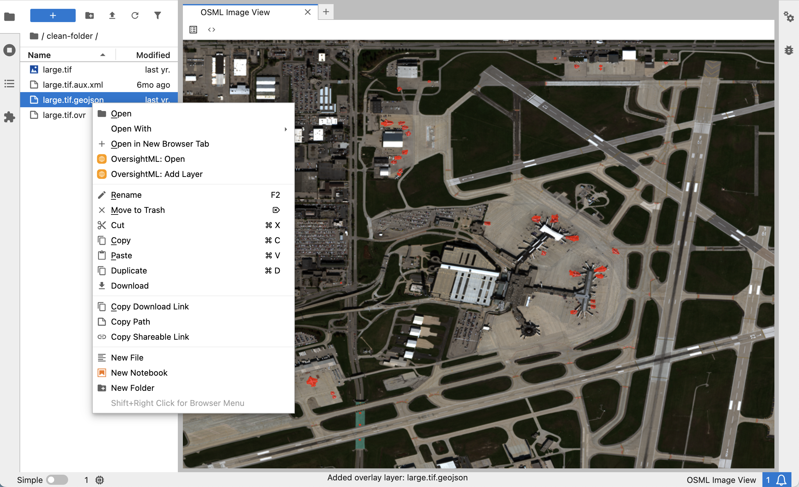

# OSML Jupyter Extension

[](https://github.com/awslabs/osml-jupyter-extension/actions/workflows/build.yml) [](https://img.shields.io/badge/python-3.9%2C%203.10%2C%203.11%2C%203.12%2C%203.13-blue) [](https://img.shields.io/badge/jupyterlab-4.0+-orange) [](https://img.shields.io/github/license/awslabs/osml-jupyter-extension?color=blue) [](https://img.shields.io/pypi/v/osml-jupyter-extension)

A JupyterLab extension that provides interactive satellite imagery visualization and analysis capabilities using the OversightML (OSML) toolkit. This extension enables data scientists, researchers, and engineers to work with satellite imagery directly within the Jupyter Notebook ecosystem without switching to external GIS tools.

> 🚧 **Early Release** - This extension is actively evolving. See [ROADMAP](docs/ROADMAP.md) for planned features and [LIMITATIONS](docs/LIMITATIONS.md) for current constraints.

## Key Features

The OSML Jupyter Extension is intended to let image scientists and machine learning engineers work with remote sensing imagery.
These images are large enough to require interactive visualization of a multi-resolution tile pyramid and require implementations of
robust sensor models to correctly overlay features. It provides:

- **Interactive Visualization**: Efficient tile-based rendering of large satellite images and feature layers using Deck.gl
- **Multi-format Support**: Native support for NITF, GeoTIFF, SICD, SIDD, and GeoJSON datasets
- **Feature Overlays**: Overlay of geospatial features using either world or image coordinates
- **Metadata Access**: View and explore image metadata and feature properties
- **Seamless Integration**: Right-click context menu integration with JupyterLab file browser
- **OSML Ecosystem**: Built on the OversightML Imagery Toolkit for additional satellite image processing



## Installation

This extension can be installed in your JupyterLab v4.0 environment. It will also require you to setup a special iPython kernel
that has GDAL, Proj, and the osml-imagery-toolkit installed.

### JupyterLab Extension Installation from PyPI

The extension can either be installed from a package distributed on PyPi or from a distribution built from source.

```bash
pip install osml-jupyter-extension
```

If building from source follow the instructions in the development install section to setup and build the distribution.
Once the distribution is available it can be installed in a jupyter lab environment of your choosing.

```bash
pip install dist/osml_jupyter_extension-0.1.0-py3-none-any.whl
```

You can verify that the extension has been successfully installed. You should see a line like
`osml-jupyter-extension v#.#.# enabled OK` output from the following command.

```bash
jupyter labextension list
```

Note that if you have already launched jupyterlab you will need to refresh your browser to see the extension
active in the frontend.

### Kernel Environment Setup

The extension requires a conda environment with GDAL, Proj, Boto3 and the OSML Imagery Toolkit. An example conda environment
has been provided for reference and can be updated to include additional OpenGIS libraries needed for your work.

1. Create the conda environment:

```bash
conda env create -f conda/osml-kernel-environment.yml
conda activate osml-kernel
```

2. Register the environment as a Jupyter kernel:

```bash
python -m ipykernel install --user --name=osml-kernel
```

3. Restart JupyterLab to see the new kernel option.

## Using the Extension

See the [USER_GUIDE](./docs/USER_GUIDE.md) for more information.

## Development

A summary of the extension's architecture can be found in [ARCHITECTURE_OVERVIEW](./docs/ARCHITECTURE_OVERVIEW.md).

### Development Install

For development work, clone the repository and set up the development environment:

```bash
# Create development conda environment
conda env create -f conda/osml-jupyterlab-ext-dev-environment.yml
conda activate osml-jupyterlab-ext-dev

# Install in development mode
pip install -e "."
jupyter labextension develop . --overwrite

# Install dependencies and build
jlpm install
jlpm build
```

### Development Workflow

```bash
# Watch for changes and auto-rebuild
jlpm watch

# Run JupyterLab in another terminal
jupyter lab
```

### Testing

```bash
# Run TypeScript tests
jlpm test:typescript

# Run Python tests
jlpm test:python
```

### Building a Distributable Package

```bash
jlpm build
python3 -m build
```

## Contributing

This project welcomes contributions and suggestions. If you would like to submit a pull request, see our
[Contribution Guide](CONTRIBUTING.md) for more information. We kindly ask that you **do not** open a public GitHub issue to report security concerns. Instead follow reporting mechanisims described in [SECURITY](SECURITY.md).

## License

This library is licensed under the Apache 2.0 License. See the [LICENSE](LICENSE) file.
