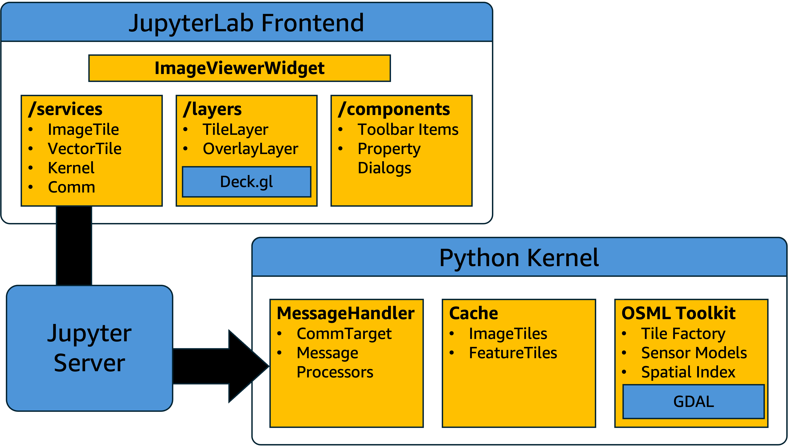
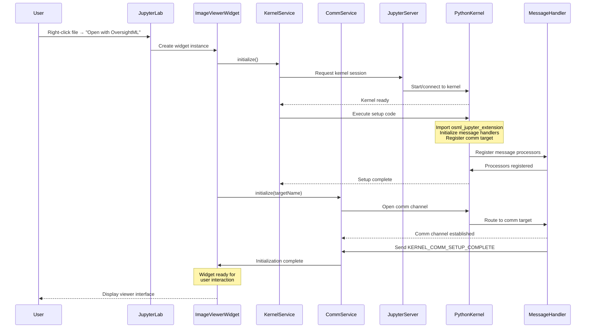
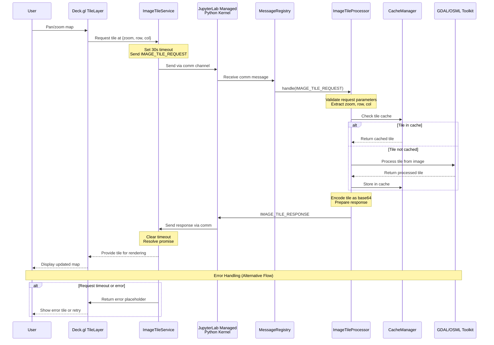

# OSML Jupyter Extension - Architecture Overview

## Introduction

The OSML (OversightML) Jupyter Extension is a JupyterLab 4.0+ prebuilt frontend extension that enables interactive visualization and analysis of satellite imagery within Jupyter notebooks. It uses high performance Deck.gl visualization
components to render raster and vector tiles retrieved from a python kernel managed by the server. It is designed for data scientists and researchers working with satellite imagery, not as a full-featured GIS application.

As a prebuilt extension, the OSML Jupyter Extension distributes JavaScript code that has been compiled and bundled ahead of time, packaged within a Python wheel for convenient installation via pip or conda. This approach eliminates the need for users to have Node.js installed or to rebuild JupyterLab when installing the extension. The prebuilt JavaScript bundle includes all necessary non-JupyterLab dependencies and can be loaded dynamically into JupyterLab at runtime, making it particularly suitable for multi-user environments where system administrators control JupyterLab installations but individual users need to add specialized functionality for their satellite imagery workflows.

## Extension Architecture

### High-Level Component Overview

The extension is divided into two logical parts. The user interface is implemented as a frontend widget that runs within the JupyterLab web application. That UI communicates with the backend code running within a python kernel managed by the JupyterLab server.

#### JupyterLab Frontend Components

**ImageViewerWidget**
The ImageViewerWidget serves as the central orchestrator for the entire satellite imagery viewing experience within JupyterLab. This main UI widget provides the primary interface that users interact with when visualizing satellite imagery, managing the complete lifecycle of all frontend services and coordinating data display through the high-performance Deck.gl visualization engine. It handles all user interactions, from initial file loading to real-time pan and zoom operations, while maintaining the connection between the user interface and the underlying data processing infrastructure.

**Data Services (`/services`)**
The data services connect the frontend to the kernel through a collection of specialized service classes that handle different aspects of the geospatial visualization experience. These services manage image tile data loading with intelligent caching and factory functions for raster imagery, process vector overlay data and feature tile management for analysis layers, coordinate kernel session lifecycle including setup code injection and status monitoring, and handle all Jupyter comm channel communication with robust message serialization and timeout management. This service-oriented architecture ensures modularity, testability, and clean separation of concerns throughout the frontend codebase.

**Layers (`/layers`)**
The layers component provides the visualization foundation through Deck.gl-based rendering capabilities that support both raster and vector data types. This system handles raster tile rendering with broad support for various satellite image formats, manages vector overlay rendering for GeoJSON features and analysis results, and leverages GPU-accelerated visualization technology to deliver high-performance mapping capabilities. The integration with Deck.gl ensures smooth interaction with large datasets while maintaining responsive performance during complex visualization operations.

**Components (`/components`)**
The components library provides the interactive user interface elements that enable users to control and explore their satellite imagery data. These components include reusable toolbar items for layer management, model selection, and metadata viewing, as well as modal dialog interfaces for displaying detailed image metadata, feature properties, and layer control settings. The component system is designed to provide a cohesive user experience that integrates seamlessly with JupyterLab's existing interface patterns.

#### Python Kernel Backend Components

**MessageHandler**
The MessageHandler serves as the central communication hub within the Python kernel, managing all incoming requests from the frontend through a registered comm target that receives and routes messages appropriately. This system employs dedicated message processors that handle different types of requests including image loading, tile requests, overlay processing, and model inference operations. Each processor is specialized for specific message types, ensuring efficient handling and proper validation of incoming requests while maintaining clean separation of concerns in the backend architecture.

**Cache System**
The cache system is a performance optimization that stores frequently accessed data to reduce processing overhead and improve response times. This system implements LRU-based caching for processed image tiles to prevent redundant tile generation, while also maintaining cached vector tile data and spatial indexes for overlay features to accelerate subsequent requests. The caching infrastructure is designed to balance memory usage with performance gains, automatically managing cache eviction and ensuring optimal resource utilization.

**OSML Toolkit Integration**
The OSML Toolkit integration forms the core processing engine that handles all geospatial data operations. This integration includes a tile factory that converts complex satellite imagery into web-compatible tiles, advanced sensor models that handle geometric correction and coordinate transformations for accurate satellite imagery positioning, efficient spatial indexing capabilities for rapid querying of large vector datasets and overlay features. GDAL integration provides the low-level geospatial data processing and broad format support across various satellite imagery and vector data types.

## Communication Architecture

The **Jupyter Server** acts as the orchestrator, managing kernel sessions and facilitating secure communication between the frontend widget and the Python kernel through Jupyter's established comm channel protocol.

### Jupyter Messaging Protocol Compliance

The extension uses Jupyter's standard comm (communication) channel system for frontend-backend communication. (see: [Jupyter Messaging](https://jupyter-client.readthedocs.io/en/stable/messaging.html) for additional details). This approach means that usesrs of the extension do not need to deploy any additional web services or authentication infrastructure to access geospatial data available to the kernel. We expect the extension to run within a Jupyter 
installation that has been properly secured (e.g. in a managed SageMaker environment) which would allow us to inherit the following functions:

- **Authentication**: Leverages Jupyter's session-based authentication
- **Kernel Isolation**: Maintains Jupyter's per-user kernel isolation model
- **Standard Error Handling**: Follows Jupyter's error propagation and logging patterns

### Comm Channel Initialization Sequence

The following sequence diagram illustrates how the frontend initializes the comm channel and establishes communication with the backend kernel when the ImageViewerWidget starts:

### Example Message Request/Response Flow

The extension uses a standardized message request/response pattern for all communication between the frontend and backend. This pattern ensures consistent error handling, timeout management, and data serialization across all operations. The following sequence diagram illustrates a typical message flow using an image tile request as an example:

