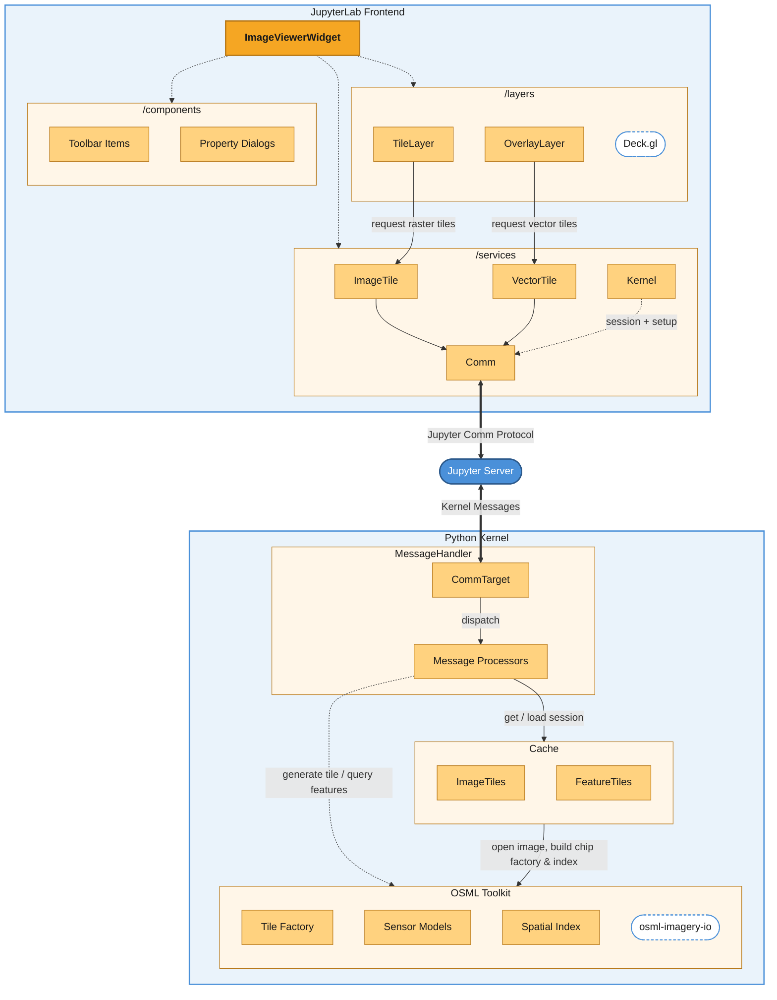
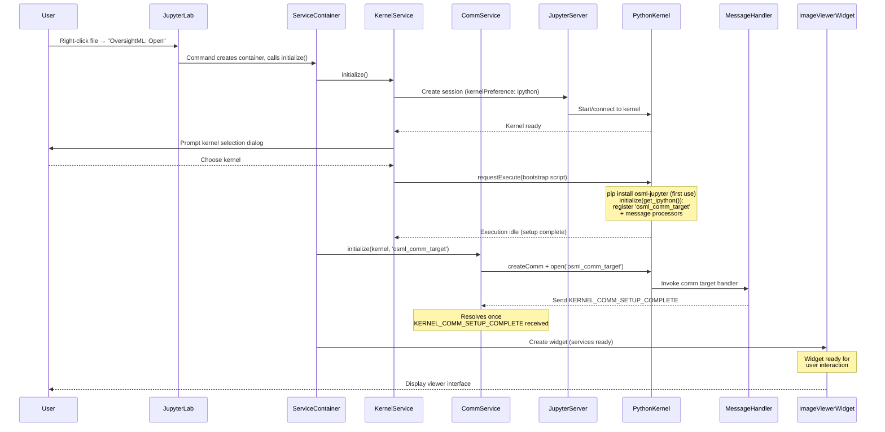
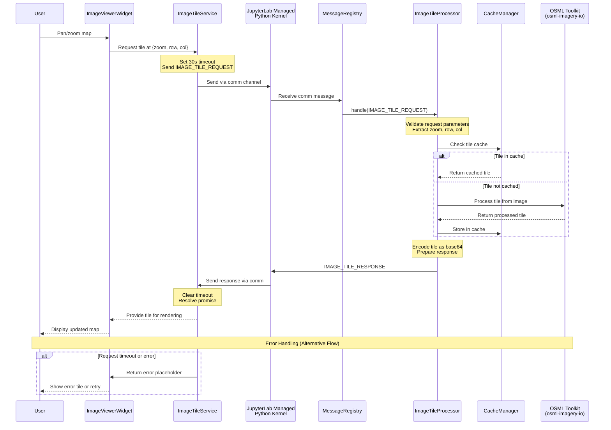

# OSML Jupyter Extension - Architecture Overview

## Introduction

The OSML (OversightML) Jupyter Extension is a JupyterLab 4.0+ prebuilt frontend extension that enables interactive visualization and analysis of satellite imagery within Jupyter notebooks. It uses high performance Deck.gl visualization
components to render raster and vector tiles retrieved from a python kernel managed by the server. It is designed for data scientists and researchers working with satellite imagery, not as a full-featured GIS application.

As a prebuilt extension, the OSML Jupyter Extension distributes JavaScript code that has been compiled and bundled ahead of time, packaged within a Python wheel for convenient installation via pip or conda. This approach eliminates the need for users to have Node.js installed or to rebuild JupyterLab when installing the extension. The prebuilt JavaScript bundle includes all necessary non-JupyterLab dependencies and can be loaded dynamically into JupyterLab at runtime, making it particularly suitable for multi-user environments where system administrators control JupyterLab installations but individual users need to add specialized functionality for their satellite imagery workflows.

## Extension Architecture

### High-Level Component Overview

The extension is divided into two logical parts. The user interface is implemented as a frontend widget that runs within the JupyterLab web application. That UI communicates with the backend code running within a python kernel managed by the JupyterLab server.

The diagram below traces the primary request path (solid arrows): rendering **layers** pull tiles from the **services**, which route requests through the **Comm** service and the Jupyter Comm Protocol to the kernel's **CommTarget**. The `MessageHandlerRegistry` dispatches each request to a **Message Processor**, which asks the **Cache** for an image session or overlay index. The cache is the factory that opens imagery via `osml-imagery-io` and builds the toolkit objects (chip factory, sensor model, spatial index); the processor then invokes those objects to generate the tile or query features. Dotted lines show orchestration and ownership rather than live request flow — the `ImageViewerWidget` creating the frontend subsystems, and the processor invoking the toolkit objects held by the cached session.

```mermaid
flowchart TB
    subgraph Frontend["JupyterLab Frontend"]
        direction TB
        IVW["<b>ImageViewerWidget</b>"]:::widget

        subgraph Layers["/layers"]
            direction TB
            L1["TileLayer"]:::component
            L2["OverlayLayer"]:::component
            L3(["Deck.gl"]):::library
        end

        subgraph Services["/services"]
            direction TB
            S1["ImageTile"]:::component
            S2["VectorTile"]:::component
            S3["Kernel"]:::component
            S4["Comm"]:::component
        end

        subgraph Components["/components"]
            direction TB
            C1["Toolbar Items"]:::component
            C2["Property Dialogs"]:::component
        end

        %% orchestration (ownership)
        IVW -.-> Layers
        IVW -.-> Services
        IVW -.-> Components

        %% data flow
        L1 -->|"request raster tiles"| S1
        L2 -->|"request vector tiles"| S2
        S1 --> S4
        S2 --> S4
        S3 -.->|"session + setup"| S4
    end

    JupyterServer(["Jupyter Server"]):::infra

    subgraph Kernel["Python Kernel"]
        direction TB
        subgraph MH["MessageHandler"]
            direction TB
            MH1["CommTarget"]:::component
            MH2["Message Processors"]:::component
        end

        subgraph Cache["Cache"]
            direction TB
            CA1["ImageTiles"]:::component
            CA2["FeatureTiles"]:::component
        end

        subgraph Toolkit["OSML Toolkit"]
            direction TB
            T1["Tile Factory"]:::component
            T2["Sensor Models"]:::component
            T3["Spatial Index"]:::component
            T4(["osml-imagery-io"]):::library
        end

        %% kernel-side data flow
        MH1 -->|"dispatch"| MH2
        MH2 -->|"get / load session"| Cache
        Cache -->|"open image, build chip factory & index"| Toolkit
        MH2 -.->|"generate tile / query features"| Toolkit
    end

    %% cross-boundary data flow
    S4 <==>|"Jupyter Comm Protocol"| JupyterServer
    JupyterServer <==>|"Kernel Messages"| MH1

    classDef widget fill:#F5A623,stroke:#B8791A,stroke-width:2px,color:#1A1A1A
    classDef component fill:#FFD27F,stroke:#B8791A,stroke-width:1px,color:#1A1A1A
    classDef library fill:#FFFFFF,stroke:#4A90D9,stroke-width:1.5px,stroke-dasharray:4 3,color:#1A1A1A
    classDef infra fill:#4A90D9,stroke:#2C5A8C,stroke-width:2px,color:#FFFFFF

    style Frontend fill:#EAF3FB,stroke:#4A90D9,stroke-width:2px,color:#1A1A1A
    style Kernel fill:#EAF3FB,stroke:#4A90D9,stroke-width:2px,color:#1A1A1A
    style Services fill:#FFF6E8,stroke:#B8791A,color:#1A1A1A
    style Layers fill:#FFF6E8,stroke:#B8791A,color:#1A1A1A
    style Components fill:#FFF6E8,stroke:#B8791A,color:#1A1A1A
    style MH fill:#FFF6E8,stroke:#B8791A,color:#1A1A1A
    style Cache fill:#FFF6E8,stroke:#B8791A,color:#1A1A1A
    style Toolkit fill:#FFF6E8,stroke:#B8791A,color:#1A1A1A
```

#### JupyterLab Frontend Components

**ImageViewerWidget**
The ImageViewerWidget serves as the central orchestrator for the entire satellite imagery viewing experience within JupyterLab. This main UI widget provides the primary interface that users interact with when visualizing satellite imagery, managing the complete lifecycle of all frontend services and coordinating data display through the high-performance Deck.gl visualization engine. It handles all user interactions, from initial file loading to real-time pan and zoom operations, while maintaining the connection between the user interface and the underlying data processing infrastructure.

**Data Services (`/services`)**
The data services connect the frontend to the kernel through a collection of specialized service classes that handle different aspects of the geospatial visualization experience. These services manage image tile data loading with intelligent caching and factory functions for raster imagery, process vector overlay data and feature tile management for analysis layers, coordinate kernel session lifecycle including setup code injection and status monitoring, and handle all Jupyter comm channel communication with robust message serialization and timeout management. This service-oriented architecture ensures modularity, testability, and clean separation of concerns throughout the frontend codebase.

**Layers (`/layers`)**
The layers component provides the visualization foundation through Deck.gl-based rendering capabilities that support both raster and vector data types. This system handles raster tile rendering with broad support for various satellite image formats, manages vector overlay rendering for GeoJSON features and analysis results, and leverages GPU-accelerated visualization technology to deliver high-performance mapping capabilities. The integration with Deck.gl ensures smooth interaction with large datasets while maintaining responsive performance during complex visualization operations.

**Components (`/components`)**
The components library provides the interactive user interface elements that enable users to control and explore their satellite imagery data. These components include reusable toolbar items for layer management, model selection, and metadata viewing, as well as modal dialog interfaces for displaying detailed image metadata, feature properties, and layer control settings. The component system is designed to provide a cohesive user experience that integrates seamlessly with JupyterLab's existing interface patterns.

#### Python Kernel Backend Components (`/kernel`)

**MessageHandler**
The MessageHandler serves as the central communication hub within the Python kernel, managing all incoming requests from the frontend through a registered comm target that receives and routes messages appropriately. This system employs dedicated message processors that handle different types of requests including image loading, tile requests, overlay processing, and model inference operations. Each processor is specialized for specific message types, ensuring efficient handling and proper validation of incoming requests while maintaining clean separation of concerns in the backend architecture.

**Cache System**
The cache system is a performance optimization that stores frequently accessed data to reduce processing overhead and improve response times. This system implements LRU-based caching for processed image tiles to prevent redundant tile generation, while also maintaining cached vector tile data and spatial indexes for overlay features to accelerate subsequent requests. The caching infrastructure is designed to balance memory usage with performance gains, automatically managing cache eviction and ensuring optimal resource utilization.

**OSML Toolkit Integration**
The OSML Toolkit integration forms the core processing engine that handles all geospatial data operations. This integration includes a tile factory that converts complex satellite imagery into web-compatible tiles, advanced sensor models that handle geometric correction and coordinate transformations for accurate satellite imagery positioning, efficient spatial indexing capabilities for rapid querying of large vector datasets and overlay features. The `osml-imagery-io` library provides the low-level geospatial data reading and broad format support across various satellite imagery and vector data types.

### Kernel Code Build and Injection System

A critical aspect of the extension's architecture is its kernel code management system, which packages the Python backend as an embedded pip-installable wheel and self-bootstraps into any running IPython kernel on first use.

The kernel code is split into two files by concern: hand-maintained bootstrap **logic** and generated **data**.

- `src/kernel/kernel-bootstrap.py` — the checked-in, hand-edited bootstrap logic. Contains no wheel data.
- `src/kernel/kernel-payload.generated.py` — a data-only file (git-ignored) written by the build. Contains three assignments and no logic: `_WHEEL_B64` (the base64-encoded wheel), `_WHEEL_SHA256` (its content hash), and `_VERSION`.

**Build-time wheel bundling (`scripts/bundle-kernel.py`):**

1. Read the version from `package.json` and set `OSML_KERNEL_VERSION` (hatchling reads it for the dynamic package version)
2. `python -m build src/kernel/ --wheel` builds the `osml-jupyter` package (the `aws.osml.jupyter` namespace package) into a wheel
3. Compute the wheel's sha256 and base64-encode it
4. Write `src/kernel/kernel-payload.generated.py` with `_WHEEL_B64`, `_WHEEL_SHA256`, and `_VERSION`
5. Clean up build artifacts (`dist/`, `*.egg-info`)

At runtime `src/utils/kernelSetupCode.ts` imports both `.py` files as raw strings (webpack `raw-loader`) and concatenates them **payload-first** (`${payload}\n\n${bootstrap}`) so the bootstrap logic can read the payload's names.

**Runtime bootstrap sequence (executed in the kernel via `requestExecute`):**

The self-heal keys on the **wheel content hash, not the version**. This is deliberate: during development the code changes without the version bumping, so a version check cannot detect changed-but-same-version code. The bootstrap compares `_WHEEL_SHA256` against a marker file (`.osml_wheel_sha256`) recorded next to the installed package and takes one of three paths:

1. **Importable and hash matches** — the installed wheel is current; skip pip entirely
2. **Importable but hash differs** (a dev rebuild at the same version) — decode the embedded wheel to a temp file and `pip install --force-reinstall --no-deps` to overwrite the stale code quickly
3. **Not importable** (a fresh environment) — full `pip install` that resolves and installs the declared dependencies (`osml-imagery-toolkit~=2.0.0a1`, `osml-imagery-io~=0.1`) from PyPI, or from the already-installed environment in pre-provisioned/air-gapped deployments

After install it records the hash to the marker, then `from aws.osml.jupyter import initialize; initialize(get_ipython())` wires up the comm target and message processors. JSON-formatted progress messages are emitted to `stdout` during installation and surfaced as JupyterLab notifications.

#### Kernel Injection and Initialization

The combined payload-plus-bootstrap script is injected into the kernel from the frontend when the ImageViewerWidget connects to a new backend kernel. Because the `osml-jupyter` wheel is installed into the kernel's `site-packages` and the hash marker is recorded alongside it, subsequent kernel reconnections find a matching hash, skip the pip step, and start instantly.

## Communication Architecture

The **Jupyter Server** acts as the orchestrator, managing kernel sessions and facilitating secure communication between the frontend widget and the Python kernel through Jupyter's established comm channel protocol.

### Jupyter Messaging Protocol Compliance

The extension uses Jupyter's standard comm (communication) channel system for frontend-backend communication. (see: [Jupyter Messaging](https://jupyter-client.readthedocs.io/en/stable/messaging.html) for additional details). This approach means that usesrs of the extension do not need to deploy any additional web services or authentication infrastructure to access geospatial data available to the kernel. We expect the extension to run within a Jupyter
installation that has been properly secured (e.g. in a managed SageMaker environment) which would allow us to inherit the following functions:

- **Authentication**: Leverages Jupyter's session-based authentication
- **Kernel Isolation**: Maintains Jupyter's per-user kernel isolation model
- **Standard Error Handling**: Follows Jupyter's error propagation and logging patterns

### Comm Channel Initialization Sequence

The following sequence diagram illustrates how the frontend initializes the comm channel and establishes communication with the backend kernel when the ImageViewerWidget starts:

```mermaid
sequenceDiagram
    participant User
    participant JupyterLab
    participant ServiceContainer
    participant KernelService
    participant CommService
    participant JupyterServer
    participant PythonKernel
    participant MessageHandler
    participant ImageViewerWidget

    User->>JupyterLab: Right-click file → "OversightML: Open"
    JupyterLab->>ServiceContainer: Command creates container, calls initialize()

    ServiceContainer->>KernelService: initialize()
    KernelService->>JupyterServer: Create session (kernelPreference: ipython)
    JupyterServer->>PythonKernel: Start/connect to kernel
    PythonKernel-->>KernelService: Kernel ready

    KernelService->>User: Prompt kernel selection dialog
    User-->>KernelService: Choose kernel

    KernelService->>PythonKernel: requestExecute(bootstrap script)
    Note over PythonKernel: pip install osml-jupyter (first use)<br/>initialize(get_ipython()):<br/>register 'osml_comm_target'<br/>+ message processors
    PythonKernel-->>KernelService: Execution idle (setup complete)

    ServiceContainer->>CommService: initialize(kernel, 'osml_comm_target')
    CommService->>PythonKernel: createComm + open('osml_comm_target')
    PythonKernel->>MessageHandler: Invoke comm target handler
    MessageHandler-->>CommService: Send KERNEL_COMM_SETUP_COMPLETE
    Note over CommService: Resolves once<br/>KERNEL_COMM_SETUP_COMPLETE received

    ServiceContainer->>ImageViewerWidget: Create widget (services ready)
    Note over ImageViewerWidget: Widget ready for<br/>user interaction
    ImageViewerWidget-->>User: Display viewer interface
```

### Example Message Request/Response Flow

The extension uses a standardized message request/response pattern for all communication between the frontend and backend. This pattern ensures consistent error handling, timeout management, and data serialization across all operations.

The following sequence diagram illustrates a typical message flow using an image tile request as an example:

```mermaid
sequenceDiagram
    participant User
    participant ImageViewerWidget
    participant ImageTileService
    participant Kernel as JupyterLab Managed<br/>Python Kernel
    participant MessageRegistry
    participant TileProcessor as ImageTileProcessor
    participant Cache as CacheManager
    participant Toolkit as OSML Toolkit<br/>(osml-imagery-io)

    User->>ImageViewerWidget: Pan/zoom map
    ImageViewerWidget->>ImageTileService: Request tile at {zoom, row, col}

    Note over ImageTileService: Set 30s timeout<br/>Send IMAGE_TILE_REQUEST
    ImageTileService->>Kernel: Send via comm channel

    Kernel->>MessageRegistry: Receive comm message
    MessageRegistry->>TileProcessor: handle(IMAGE_TILE_REQUEST)

    Note over TileProcessor: Validate request parameters<br/>Extract zoom, row, col

    TileProcessor->>Cache: Check tile cache
    alt Tile in cache
        Cache-->>TileProcessor: Return cached tile
    else Tile not cached
        TileProcessor->>Toolkit: Process tile from image
        Toolkit-->>TileProcessor: Return processed tile
        TileProcessor->>Cache: Store in cache
    end

    Note over TileProcessor: Encode tile as base64<br/>Prepare response

    TileProcessor->>Kernel: IMAGE_TILE_RESPONSE
    Kernel->>ImageTileService: Send response via comm

    Note over ImageTileService: Clear timeout<br/>Resolve promise
    ImageTileService-->>ImageViewerWidget: Provide tile for rendering
    ImageViewerWidget-->>User: Display updated map

    Note over User,Toolkit: Error Handling (Alternative Flow)
    alt Request timeout or error
        ImageTileService->>ImageViewerWidget: Return error placeholder
        ImageViewerWidget-->>User: Show error tile or retry
    end
```

### Notebook Interoperability (the `viewer` object)

Beyond the frontend-driven request/response flow above, the extension exposes a
programmatic `viewer` object at `aws.osml.jupyter` that lets analysts drive the
image viewer from an attached notebook. This is built on a **bidirectional lane**
over the same `osml_comm_target` comm:

- **State stream (frontend → kernel):** as the analyst navigates, the frontend
  emits fire-and-forget `VIEW_STATE_UPDATE` (after the view settles, ~300 ms) and
  `CLICK_EVENT` (one per click) messages carrying **raw image-space** coordinates.
  A kernel-side `ViewStateStore` is the single source of truth for live view
  state; it does no sensor-model math on write.
- **Push channel (kernel → frontend):** the kernel pushes render commands
  (`ADD_LAYER`, `REMOVE_LAYER`, `SET_VIEW`) to a persistent frontend
  `PushDispatcher` via a `CommRegistry.broadcast` to all live comms. A permanent
  `CommService` demultiplexer routes push types to the dispatcher and
  `*_RESPONSE` types to the existing correlation layer.

The `viewer` singleton lazily binds to the `ViewStateStore`, `CommRegistry`, and
cache populated by `initialize()`. It lets a notebook read live state
(`current_image`, `view_bounds`, `last_click`), reach the toolkit objects for the
current image (`reader` / `sensor_model` / `chip_factory`), query imagery
(`metadata()` / `statistics()` / `features_in()`), and push results back
(`add_layer()` / `remove_layer()` / `goto()` / `set_view()`). The image → world
transform is computed lazily on `.world` reads and memoized per bounds / click.
The supported topology is **viewer-first** (open an image, then attach a notebook
to the viewer's kernel). See
[`docs/examples/notebook_viewer_example.ipynb`](examples/notebook_viewer_example.ipynb)
for a worked example.

Notebook-created layers use the same tile-rendering path as the file-browser
"OversightML: Add Layer" context-menu action; `viewer.add_layer` supersedes the
old type-a-name "Add Dataset Layer" panel widget, which has been retired.

## Alternatives Considered

During the design phase of the OSML Jupyter Extension, several architectural approaches were evaluated before settling on the current frontend-only extension with direct kernel communication pattern. Two primary alternatives were considered and ultimately rejected in favor of the current approach.

### Jupyter Frontend + Server Extension

A Jupyter Frontend + Server extension approach would have involved creating both a frontend component and a corresponding server extension that adds custom REST API endpoints to the JupyterLab server. This approach would have enabled the extension to define specialized HTTP endpoints for satellite imagery processing, tile serving, and geospatial operations, potentially providing more traditional web service patterns and better separation between the user interface and data processing layers. However, this approach was rejected because the team wanted to interact directly with a running kernel rather than through an intermediate server layer. The OSML Jupyter Extension is conceptually designed as an imagery and geospatial view on top of the information and processing capabilities already available within a kernel environment, not as a standalone service. This kernel-centric approach ensures that users can leverage their existing Python environments, installed packages, and data access patterns without requiring additional server infrastructure or administrative setup beyond what JupyterLab already provides.

### Jupyter Document / MIME Type Extension

A Jupyter Document / MIME type extension approach would have implemented the satellite imagery viewer as a specialized document renderer that could display specific file types (such as GeoTIFF, NITF, or other satellite imagery formats) directly within JupyterLab's document system, similar to how the built-in PDF viewer or JSON viewer operates. This approach seemed initially attractive due to its simplicity and direct integration with JupyterLab's file browser, allowing users to simply double-click on satellite imagery files to view them. However, this approach was ultimately deemed too restrictive for the full extent of interactions and functionality planned for the OSML Jupyter Extension. The extension's roadmap includes capabilities that extend far beyond single document viewing, such as rendering and analyzing multiple documents simultaneously, providing direct integration with SageMaker model endpoints for inference and analysis, supporting complex geospatial workflows that involve multiple data sources and processing steps, and enabling programmatic interaction with the viewer from notebook cells. All of these planned capabilities fall outside the document viewer model and are more appropriately implemented as a general frontend widget that can interact with multiple data sources, manage complex state, and integrate with external services and APIs.
