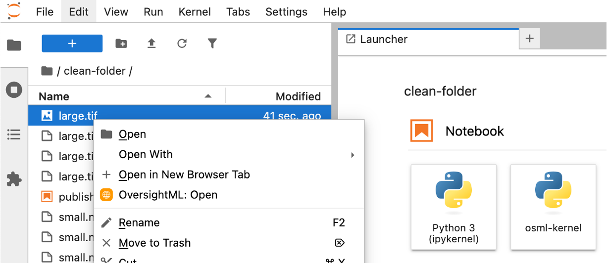
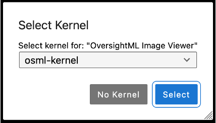
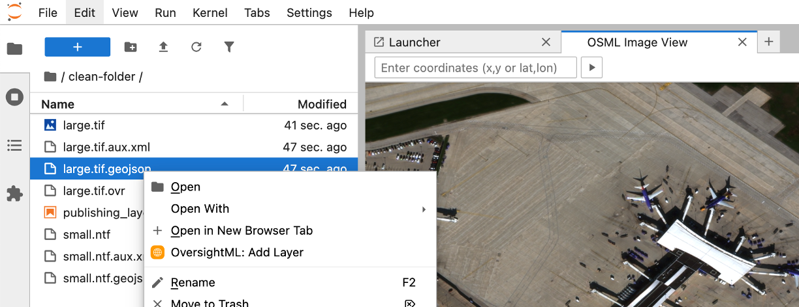
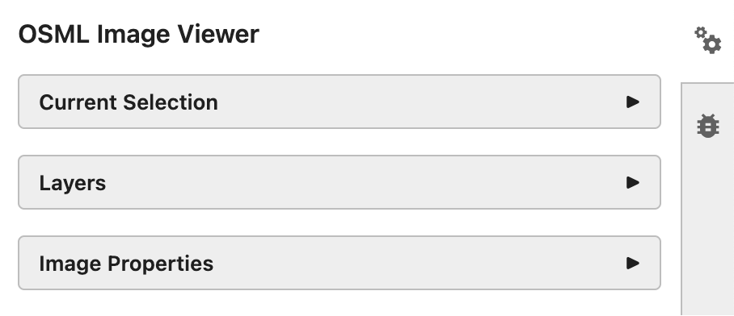
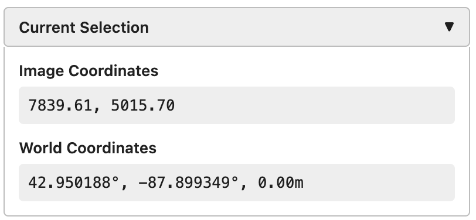
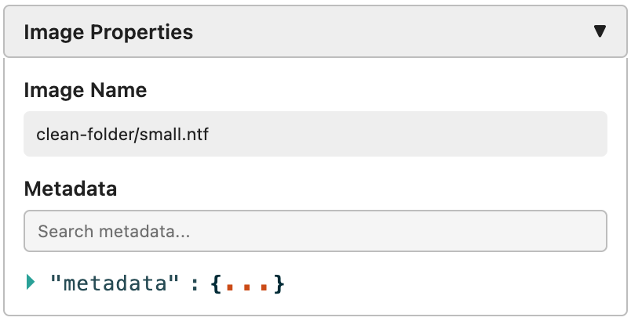
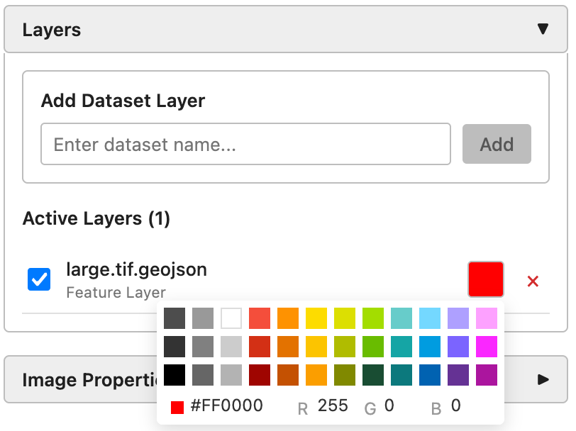
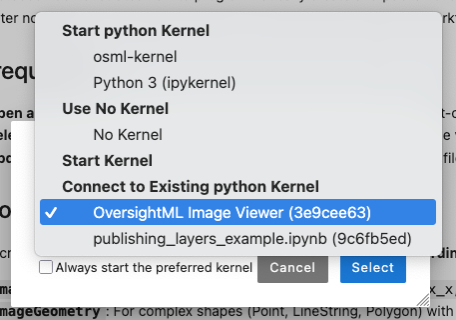

# OSML Jupyter Extension User Guide

## Introduction

Welcome to the OSML Jupyter Extension! This extension brings satellite imagery visualization capabilities directly into your JupyterLab environment, allowing data scientists, researchers, and engineers to work with complex satellite imagery formats (GeoTIFF, NITF, SICD, SIDD) without leaving their familiar Jupyter workflow.

> **⚠️ Early Release Notice**: This extension is in active development with APIs that may change. This guide corresponds to the current release candidate version. See [ROADMAP](ROADMAP.md) for planned features and [LIMITATIONS](LIMITATIONS.md) for current constraints.

### Who This Extension Is For

This extension is designed for **data scientists and engineers building tools for satellite imagery analysts**, not as a replacement for full-featured electronic light tables (ELTs) or geographic information system (GIS) software. It's particularly well-suited for:

- Machine learning workflows involving satellite imagery
- Data exploration and visualization in Jupyter notebooks
- Integration with AWS SageMaker AI environments

### Key Features

- Interactive visualization of satellite imagery formats
- Overlay multiple geospatial data layers
- Pan, zoom, and explore large imagery datasets
- Access image metadata and feature properties
- Seamless integration with Jupyter notebooks

## Getting Started

### 1. Opening an Image

To view satellite imagery in the extension:

1. **Navigate to your image file** in the JupyterLab file browser
2. **Right-click** on a supported image file with extensions: `.ntf`, `.nitf`, `.tiff`, or `.tif`
3. **Select "OversightML: Open"** from the context menu (this option only appears for supported image files)
4. **Choose the kernel** that has osml-imagery-toolkit installed (typically `osml-kernel`)





The image viewer will open in a new tab, and the image will begin loading. You'll see status updates in the JupyterLab status bar during the loading process.

### 2. Adding Overlay Layers

To add GeoJSON feature overlays to your image:

1. **Ensure an image is already open** in the viewer (this is required before adding layers)
2. **Right-click** on a GeoJSON file (`.geojson` extension) in the file browser
3. **Select "OversightML: Add Layer"** from the context menu (this option only appears for `.geojson` files)



The overlay will be added to your current image viewer. You can add multiple layers this way, and each will appear as a separate overlay on your image.

### 3. Navigating the Image

The image viewer is built using Deck.gl which provides common navigation controls:

- **Pan**: Click and drag anywhere on the image to move around
- **Zoom**: Use your mouse wheel to zoom in and out
- **Reset View**: Use the zoom controls in the toolbar to reset to full extent

The viewer is optimized for large satellite imagery files and will load additional detail as you zoom in.

#### Geographic Navigation with GeoJump

The toolbar includes a coordinate input tool that enables direct navigation to specific locations:


1. **Enter coordinates** in the input field using either:
   - **Image coordinates**: `x,y` format (e.g., `1024,768`)
   - **World coordinates**: `latitude,longitude` format (e.g., `40.7128,-74.0060`)
2. **Press Enter** or click the navigation button to fly to the specified location
3. The viewer will automatically pan and zoom to center on the requested coordinates

### 4. Using the Property Inspector

The property inspector in the right sidebar provides comprehensive information about your current selection, layers, and image metadata. This panel is used in the same way the notebook property inspector is used within JupyterLab. It contains three main sections:



#### Current Selection Properties

The property inspector displays different information based on what you've selected:

**Feature Selection**: When you click on any feature (point, line, or polygon) from an overlay layer, the property inspector shows all metadata associated with that feature, including detection types, confidence scores, or other analytical data embedded in your GeoJSON features.

**Location Selection**: When you click on a location on the image (not on a feature), the property inspector displays both image coordinates (pixel position) and world coordinates (latitude/longitude) for that location.



> **⚠️ Coordinate Accuracy Note**: World coordinates are calculated using the image's sensor model without external elevation data. For improved accuracy, future releases will integrate digital elevation models. See [LIMITATIONS.md](LIMITATIONS.md) for details.

#### Image Metadata

The property inspector displays comprehensive metadata about the currently loaded satellite image, including sensor information, acquisition details, and geospatial properties.



#### Layer Management

The layer management section allows you to:

- View all active layers
- Toggle layer visibility on/off
- Remove layers from the display
- Add layers published from a notebook to the display (see: Advanced Usage)



### 5. Viewing Logging Information

Extension logging information is available through JupyterLab's log console for troubleshooting and system monitoring.

**To view logs**: Open `View` → `Show Log Console` from the main menu

The logs contain image loading status, layer management events, coordinate transformations, and error messages.

## Advanced Usage

### Connecting Jupyter Notebooks to the Extension

One of the powerful features of the OSML Jupyter Extension is its ability to work alongside regular Jupyter notebooks. When you open an image with the extension, it creates a kernel session that can be shared with notebook cells.

#### Setting Up Notebook Integration

1. **Open an image** using the extension (this establishes the kernel session)
2. **Create or open a Jupyter notebook** in the same JupyterLab instance
3. **Select the same kernel** that's being used by the image viewer. There should be a kernel named OversightML Image Viewer in the section for existing python kernels.



#### Publishing Layers from Notebook Code

Once your notebook is connected to the same kernel, you can programmatically create and display layers. The extension supports creating features using **pixel coordinates** which are automatically converted to geographic coordinates.

##### Complete Example Notebook

For a comprehensive example of publishing layers from notebook code, see our complete example notebook:

📓 **[Publishing Layers Example Notebook](examples/publishing_layers_example.ipynb)**

This notebook includes examples of:

- Object detection results with bounding boxes
- Road networks using LineString geometries
- Example regions with Polygon boundaries

##### Quick Start Example

Here's a simple example to get you started:

```python
import geojson

# Prepare a feature collection for serving tiles.
# NOTE: This function will likely be moved into a reusable library for use by the
# extension.
def publish_overlay(image_name, collection_name, fc):
    accessor = ImagedFeaturePropertyAccessor()
    for f in fc['features']:
        geom = accessor.find_image_geometry(f)
        accessor.set_image_geometry(f, geom)

    tile_index = STRFeature2DSpatialIndex(fc, use_image_geometries=True)
    key = f"{image_name}:{collection_name}"
    global_cache_manager.set_overlay_factory(key, tile_index)

# Create a simple detection result using pixel coordinates
detection = geojson.Feature(
    geometry=None,  # No geographic coordinates needed
    properties={
        "imageBBox": [100, 200, 150, 250],  # [min_x, min_y, max_x, max_y] in pixels
        "confidence": 0.95,
        "object_class": "vehicle"
    }
)

detection_collection = geojson.FeatureCollection(features=[detection])

# Publish to the image viewer (replace with your image filename)
publish_overlay("your_image.tif", "Detections", detection_collection)
```

#### Feature Coordinate Systems

The extension supports two ways to specify feature locations in **pixel coordinates**:

##### Using `imageBBox` for Rectangular Regions

Perfect for object detection bounding boxes:

```python
"properties": {
    "imageBBox": [min_x, min_y, max_x, max_y],  # Pixel coordinates
    "confidence": 0.90,
    "object_class": "building"
}
```

##### Using `imageGeometry` for Complex Shapes

For detailed geometries like roads, boundaries, or precise object outlines:

**Point Geometry:**

```python
"properties": {
    "imageGeometry": {
        "type": "Point",
        "coordinates": [x, y]  # Pixel coordinates (x, y)
    }
}
```

**LineString Geometry (for roads, paths):**

```python
"properties": {
    "imageGeometry": {
        "type": "LineString",
        "coordinates": [[x1, y1], [x2, y2], [x3, y3]]  # Array of [x, y] pixel coordinates
    }
}
```

**Polygon Geometry (for areas, boundaries):**

```python
"properties": {
    "imageGeometry": {
        "type": "Polygon",
        "coordinates": [[[x1, y1], [x2, y2], [x3, y3], [x1, y1]]]  # Closed polygon
    }
}
```

> **📍 Coordinate System**: Pixel coordinates use the **top-left corner as (0,0)** with x increasing rightward and y increasing downward. The extension automatically converts these pixel coordinates to geographic coordinates based on the image's geospatial metadata.

#### Working with Multiple Data Sources

You can combine data from various sources and publish them as layers:

```python
# Create detection results
detections = create_detection_results()  # Your analysis function

# Create analysis regions
regions = create_analysis_regions()      # Your region definition

# Publish both layers
publish_overlay("satellite_image.tif", "Object_Detections", detections)
publish_overlay("satellite_image.tif", "Analysis_Regions", regions)
```

---

_This guide corresponds to OSML Jupyter Extension early release version. For the latest updates and documentation, visit our GitHub repository._
