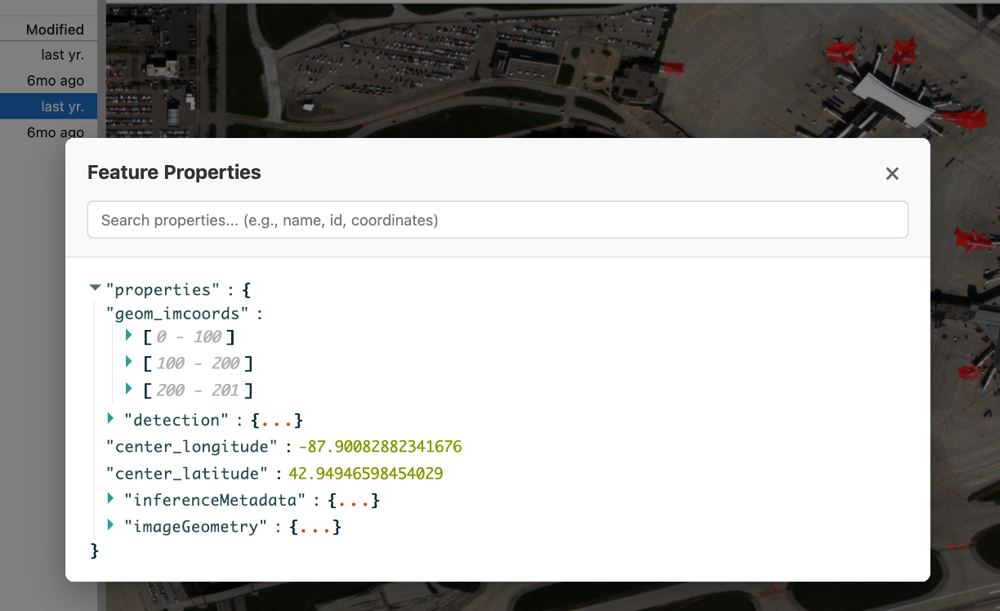
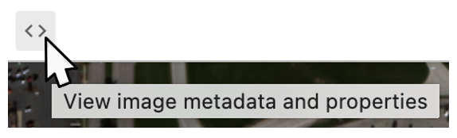
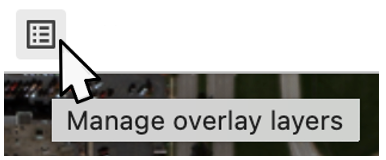
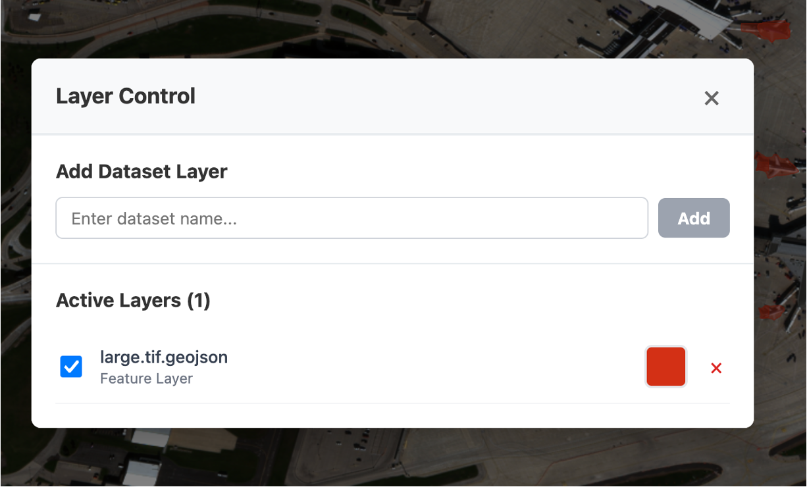

# OSML Jupyter Extension User Guide

## Introduction

Welcome to the OSML Jupyter Extension! This is an **early release** of the extension provided for review and feedback from the community. 

> **⚠️ Important Notice**: This extension is currently in active development. The APIs and interfaces have not been finalized and may change in future releases. Please provide feedback through our GitHub repository to help shape the final version.

The OSML Jupyter Extension brings satellite imagery visualization capabilities directly into your JupyterLab environment. It allows data scientists, researchers, and engineers to work with complex satellite imagery formats (GeoTIFF, NITF, SICD, SIDD) without leaving their familiar Jupyter workflow.

### Key Features
- Interactive visualization of satellite imagery formats
- Overlay multiple geospatial data layers
- Pan, zoom, and explore large imagery datasets
- Access image metadata and feature properties
- Seamless integration with Jupyter notebooks

## Getting Started

### 1. Opening an Image

To view satellite imagery in the extension:

1. **Navigate to your image file** in the JupyterLab file browser
2. **Right-click** on a supported image file (GeoTIFF, NITF, SICD, SIDD)
3. **Select "OversightML: Open"** from the context menu
4. **Choose the kernel** that has osml-imagery-toolkit installed (typically `osml-kernel`)


The image viewer will open in a new tab, and the image will begin loading. You'll see status updates in the JupyterLab status bar during the loading process.

### 2. Adding Overlay Layers

To add GeoJSON feature overlays to your image:

1. **Ensure an image is already open** in the viewer (this is required before adding layers)
2. **Right-click** on a GeoJSON file in the file browser
3. **Select "OversightML: Add Layer"** from the context menu


The overlay will be added to your current image viewer. You can add multiple layers this way, and each will appear as a separate overlay on your image.

### 3. Navigating the Image

The image viewer is built using Deck.gl which provides common navigation controls:

- **Pan**: Click and drag anywhere on the image to move around
- **Zoom**: Use your mouse wheel to zoom in and out
- **Reset View**: Use the zoom controls in the toolbar to reset to full extent

The viewer is optimized for large satellite imagery files and will load additional detail as you zoom in.

### 4. Viewing Feature Properties

To inspect the properties of overlaid features:

1. **Right-click** on any feature (point, line, or polygon) in an overlay layer
2. A **properties dialog** will appear showing all metadata associated with that feature



This is particularly useful for examining detection types, confidence scores, or other analytical data embedded in your GeoJSON features. A search bar is available to filter the properties down to items matching a selected key.

### 5. Viewing Image Metadata

To access metadata about the loaded satellite image:  


1. **Click the metadata tool** in the image viewer toolbar 
2. The **Image Metadata Dialog** will open, displaying metadata unique to each image. 

### 6. Managing Layers

To view and control your overlay layers:  


1. **Click the layers tool** in the image viewer toolbar
2. The **Layer Control Dialog** will open, allowing you to:
   - View all active layers
   - Toggle layer visibility on/off
   - Remove layers from the display
   - Add layers published from a notebook to the display (see: Advanced Usage)



## Advanced Usage

### Connecting Jupyter Notebooks to the Extension

One of the powerful features of the OSML Jupyter Extension is its ability to work alongside regular Jupyter notebooks. When you open an image with the extension, it creates a kernel session that can be shared with notebook cells.

#### Setting Up Notebook Integration

1. **Open an image** using the extension (this establishes the kernel session)
2. **Create or open a Jupyter notebook** in the same JupyterLab instance
3. **Select the same kernel** that's being used by the image viewer. There should be a kernel named OversightML Image Viewer in the section for existing python kernels.


#### Publishing Layers from Notebook Code

Once your notebook is connected to the same kernel, you can programmatically create and display layers. The extension supports creating features using **pixel coordinates** which are automatically converted to geographic coordinates.

##### Complete Example Notebook

For a comprehensive example of publishing layers from notebook code, see our complete example notebook:

📓 **[Publishing Layers Example Notebook](examples/publishing_layers_example.ipynb)**

This notebook includes examples of:
- Object detection results with bounding boxes
- Road networks using LineString geometries
- Example regions with Polygon boundaries

##### Quick Start Example

Here's a simple example to get you started:

```python
import geojson

# Prepare a feature collection for serving tiles.
# NOTE: This function will likely be moved into a reusable library for use by the
# extension.
def publish_overlay(image_name, collection_name, fc):
    accessor = ImagedFeaturePropertyAccessor()
    for f in fc['features']:
        geom = accessor.find_image_geometry(f)
        accessor.set_image_geometry(f, geom)
            
    tile_index = STRFeature2DSpatialIndex(fc, use_image_geometries=True)
    key = f"{image_name}:{collection_name}"
    global_cache_manager.set_overlay_factory(key, tile_index)    

# Create a simple detection result using pixel coordinates
detection = geojson.Feature(
    geometry=None,  # No geographic coordinates needed
    properties={
        "imageBBox": [100, 200, 150, 250],  # [min_x, min_y, max_x, max_y] in pixels
        "confidence": 0.95,
        "object_class": "vehicle"
    }
)

detection_collection = geojson.FeatureCollection(features=[detection])

# Publish to the image viewer (replace with your image filename)
publish_overlay("your_image.tif", "Detections", detection_collection)
```

#### Feature Coordinate Systems

The extension supports two ways to specify feature locations in **pixel coordinates**:

##### Using `imageBBox` for Rectangular Regions
Perfect for object detection bounding boxes:
```python
"properties": {
    "imageBBox": [min_x, min_y, max_x, max_y],  # Pixel coordinates
    "confidence": 0.90,
    "object_class": "building"
}
```

##### Using `imageGeometry` for Complex Shapes
For detailed geometries like roads, boundaries, or precise object outlines:

**Point Geometry:**
```python
"properties": {
    "imageGeometry": {
        "type": "Point",
        "coordinates": [x, y]  # Pixel coordinates (x, y)
    }
}
```

**LineString Geometry (for roads, paths):**
```python
"properties": {
    "imageGeometry": {
        "type": "LineString",
        "coordinates": [[x1, y1], [x2, y2], [x3, y3]]  # Array of [x, y] pixel coordinates
    }
}
```

**Polygon Geometry (for areas, boundaries):**
```python
"properties": {
    "imageGeometry": {
        "type": "Polygon",
        "coordinates": [[[x1, y1], [x2, y2], [x3, y3], [x1, y1]]]  # Closed polygon
    }
}
```

> **📍 Coordinate System**: Pixel coordinates use the **top-left corner as (0,0)** with x increasing rightward and y increasing downward. The extension automatically converts these pixel coordinates to geographic coordinates based on the image's geospatial metadata.

#### Working with Multiple Data Sources

You can combine data from various sources and publish them as layers:

```python
# Create detection results
detections = create_detection_results()  # Your analysis function

# Create analysis regions
regions = create_analysis_regions()      # Your region definition

# Publish both layers
publish_overlay("satellite_image.tif", "Object_Detections", detections)
publish_overlay("satellite_image.tif", "Analysis_Regions", regions)
```

## Troubleshooting

### Common Issues

#### "No suitable kernel found"
- **Cause**: The osml-kernel environment is not properly configured
- **Solution**: Ensure you have created the conda environment with all required dependencies
- **Check**: Run `conda list` in your osml-kernel environment to verify osml-imagery-toolkit is installed

#### "Image failed to load"
- **Cause**: File format not supported or corrupted file
- **Solution**: Verify your file is a valid GeoTIFF, NITF, SICD, or SIDD format
- **Check**: Try opening the file with a different tool to verify it's not corrupted

#### "Cannot add layer - no image viewer open"
- **Cause**: Attempting to add a layer before opening an image
- **Solution**: Always open an image first, then add overlay layers

#### Performance Issues with Large Images
- **Symptoms**: Slow loading, browser becoming unresponsive
- **Solutions**: 
  - Use image pyramids/overviews when available
  - Close other browser tabs to free up memory

#### Layers Not Displaying
- **Check**: Verify the GeoJSON file has valid geometry
- **Check**: Ensure the coordinate reference system matches your image
- **Solution**: Use the layer control dialog to verify the layer is enabled and visible

### Getting Help

If you encounter issues not covered in this guide:

1. **Check the console**: Open your browser's developer console (F12) for error messages
2. **Review the status bar**: JupyterLab's status bar often shows helpful information
3. **GitHub Issues**: Report bugs and request features at our GitHub repository

### Performance Tips

- **Use appropriate zoom levels**: Don't zoom in beyond the native resolution of your imagery
- **Limit overlay complexity**: Very detailed vector layers can impact performance
- **Restart kernels**: If you experience memory issues, restart the kernel from the Jupyter menu
- **Browser resources**: The extension works best with modern browsers and adequate RAM

## Supported File Formats

### Satellite Imagery
- **NITF** (.nitf, .ntf) - National Imagery Transmission Format
- **SICD** (.sicd) - Sensor Independent Complex Data
- **SIDD** (.sidd) - Sensor Independent Derived Data
- **GeoTIFF** (.tif, .tiff) - Common format for commercial satellite imagery

### Vector Overlays
- **GeoJSON** (.geojson, .json) - Geographic JavaScript Object Notation
- Must contain valid geometry (Point, LineString, Polygon, etc.)
- Properties are preserved and displayed in the feature inspector

## What's Next?

This extension is under active development. Upcoming features include:

- Additional file format support
- Enhanced styling options for overlay layers
- Better integration with common geospatial Python libraries
- Performance improvements for very large datasets
- Batch processing capabilities

Your feedback helps prioritize these developments. Please share your thoughts and suggestions through our GitHub repository.

---

*This guide corresponds to OSML Jupyter Extension early release version. For the latest updates and documentation, visit our GitHub repository.*
