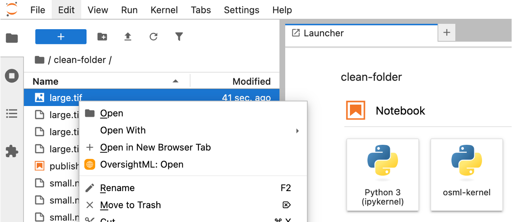
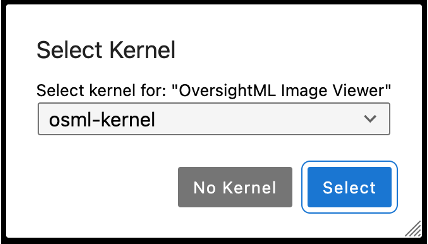
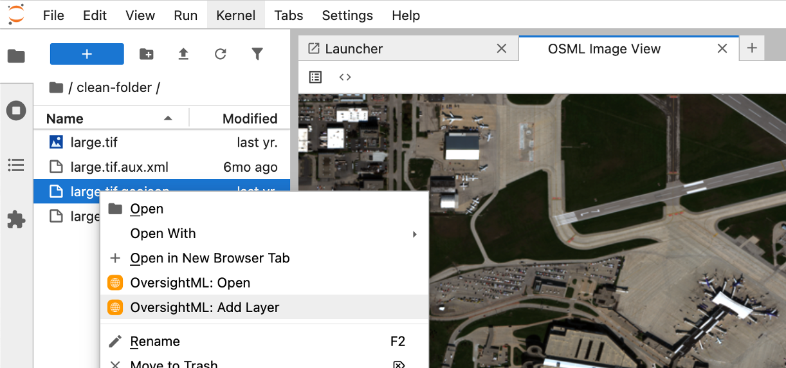
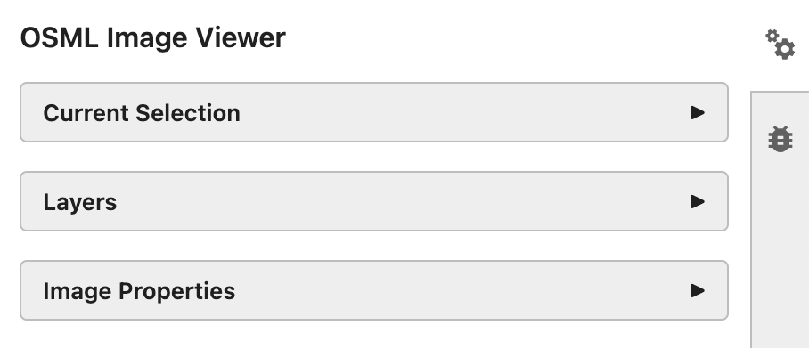
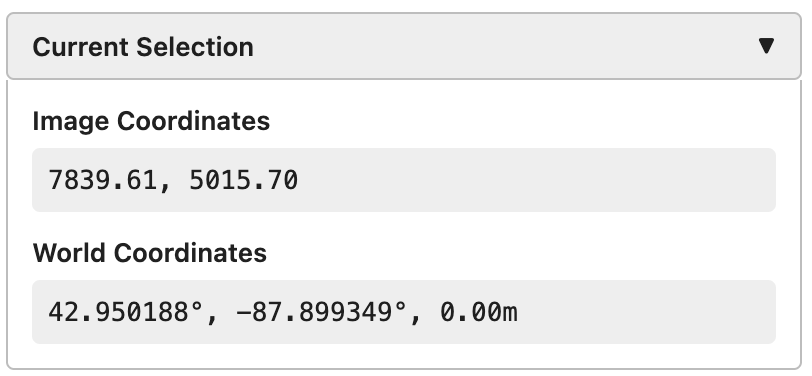
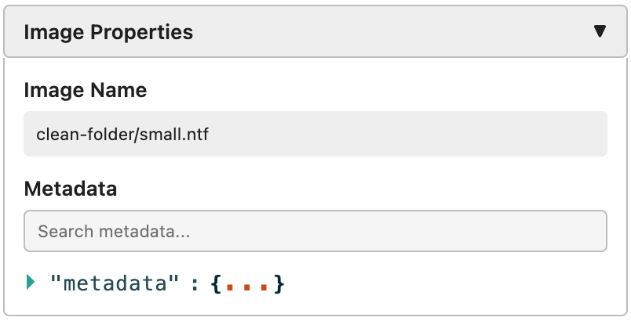
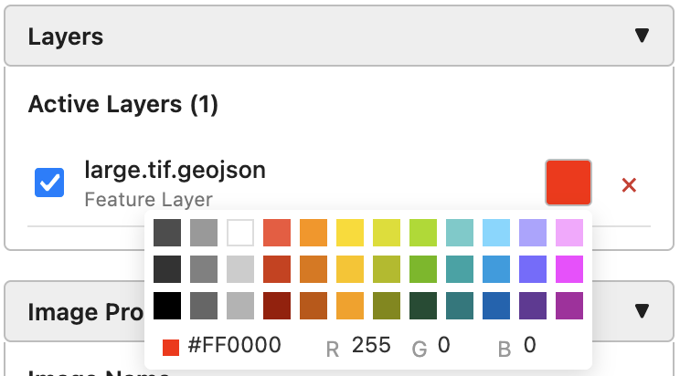
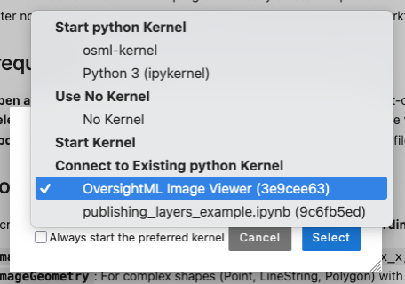

# OSML Jupyter Extension User Guide

## Introduction

Welcome to the OSML Jupyter Extension! This extension brings satellite imagery visualization capabilities directly into your JupyterLab environment, allowing data scientists, researchers, and engineers to work with complex satellite imagery formats (GeoTIFF, NITF, SICD, SIDD) without leaving their familiar Jupyter workflow.

> **⚠️ Early Release Notice**: This extension is in active development with APIs that may change. This guide corresponds to the current release candidate version. See [ROADMAP](ROADMAP.md) for planned features and [LIMITATIONS](LIMITATIONS.md) for current constraints.

### Who This Extension Is For

This extension is designed for **data scientists and engineers building tools for satellite imagery analysts**, not as a replacement for full-featured electronic light tables (ELTs) or geographic information system (GIS) software. It's particularly well-suited for:

- Machine learning workflows involving satellite imagery
- Data exploration and visualization in Jupyter notebooks
- Integration with AWS SageMaker AI environments

### Key Features

- Interactive visualization of satellite imagery formats
- Overlay multiple geospatial data layers
- Pan, zoom, and explore large imagery datasets
- Access image metadata and feature properties
- Seamless integration with Jupyter notebooks

## Getting Started

### 1. Opening an Image

To view satellite imagery in the extension:

1. **Navigate to your image file** in the JupyterLab file browser
2. **Right-click** on a supported image file with extensions: `.ntf`, `.nitf`, `.tiff`, or `.tif`
3. **Select "OversightML: Open"** from the context menu (this option only appears for supported image files)
4. **Choose any Python kernel** from the kernel selection dialog — no special setup is required





The image viewer will open in a new tab. On first use, the extension will automatically install its Python dependencies into the selected kernel environment using `pip`. A progress notification will appear in the lower-right corner during installation, which typically takes 10–30 seconds depending on network speed. Subsequent uses of the same kernel are instant — the already-installed package is detected and no network access is needed.

> **Air-gapped / pre-provisioned environments**: If your kernel cannot reach PyPI, pre-install `osml-imagery-toolkit` and `osml-imagery-io` into the kernel environment before using the extension. The bootstrap will detect the pre-installed dependencies and complete installation without any outbound network access. See `conda/osml-kernel-environment.yml` for an example environment specification.

### 2. Adding Overlay Layers

To add GeoJSON feature overlays to your image:

1. **Ensure an image is already open** in the viewer (this is required before adding layers)
2. **Right-click** on a GeoJSON file (`.geojson` extension) in the file browser
3. **Select "OversightML: Add Layer"** from the context menu (this option only appears for `.geojson` files)



The overlay will be added to your current image viewer. You can add multiple layers this way, and each will appear as a separate overlay on your image.

### 3. Navigating the Image

The image viewer is built using Deck.gl which provides basic navigation controls:

- **Pan**: Click and drag anywhere on the image to move around
- **Zoom**: Use your mouse wheel to zoom in and out

The viewer is optimized for large satellite imagery files and will load tiles of different resolution as
you change zoom levels.

Note that there currently is not any way to rotate the view. This feature is being considered for a
future release.

#### Geographic Navigation with GeoJump

The toolbar includes a coordinate input tool that enables direct navigation to specific locations:


1. **Enter coordinates** in the input field using either:
   - **Image coordinates**: `x,y` format (e.g., `1024,768`)
   - **World coordinates**: `latitude,longitude` format (e.g., `40.7128,-74.0060`)
2. **Press Enter** or click the navigation button to fly to the specified location
3. The viewer will automatically pan and zoom to center on the requested coordinates

### 4. Using the Property Inspector

The property inspector in the right sidebar provides comprehensive information about your current selection, layers, and image metadata. This panel is used in the same way the notebook property inspector is used within JupyterLab. It contains three main sections:



#### Current Selection Properties

The property inspector displays different information based on what you've selected:

**Feature Selection**: When you click on any feature (point, line, or polygon) from an overlay layer, the property inspector shows all metadata associated with that feature, including detection types, confidence scores, or other analytical data embedded in your GeoJSON features.

**Location Selection**: When you click on a location on the image (not on a feature), the property inspector displays both image coordinates (pixel position) and world coordinates (latitude/longitude) for that location.



> **⚠️ Coordinate Accuracy Note**: World coordinates are calculated using the image's sensor model without external elevation data. For improved accuracy, future releases will integrate digital elevation models. See [LIMITATIONS.md](LIMITATIONS.md) for details.

#### Image Metadata

The property inspector displays comprehensive metadata about the currently loaded satellite image, including sensor information, acquisition details, and geospatial properties.



#### Layer Management

The layer management section allows you to:

- View all active layers
- Toggle layer visibility on/off
- Remove layers from the display
- Add layers published from a notebook to the display (see: Advanced Usage)



### 5. Viewing Logging Information

Extension logging information is available through JupyterLab's log console for troubleshooting and system monitoring.

**To view logs**: Open `View` → `Show Log Console` from the main menu

The logs contain image loading status, layer management events, coordinate transformations, and error messages.

## Advanced Usage

### Connecting Jupyter Notebooks to the Extension

One of the powerful features of the OSML Jupyter Extension is its ability to work alongside regular Jupyter notebooks. When you open an image with the extension, it creates a kernel session that can be shared with notebook cells.

#### Setting Up Notebook Integration

1. **Open an image** using the extension (this establishes the kernel session)
2. **Create or open a Jupyter notebook** in the same JupyterLab instance
3. **Select the same kernel** that's being used by the image viewer. There will be a running kernel named OversightML Image Viewer in the list of existing Python kernels — connecting to it shares the already-bootstrapped session with no additional setup.



#### The `viewer` Object

Once your notebook is connected to the same kernel, import the `viewer` object to drive the extension from notebook code:

```python
from aws.osml.jupyter import viewer, ViewerError

# The dataset path the viewer currently has open (or None).
print(viewer.current_image)
```

`viewer` is a singleton bound to the kernel's live state. It lets you **read** the current view (bounds, clicks), **reach** the underlying toolkit objects for the open image, **query** imagery, and **push** results back as rendered layers or viewport moves. Reading or acting on `viewer` before an image is open raises `ViewerError`.

> **📌 Viewer-first topology**: The supported flow is to _open an image first_, then attach a notebook to the viewer's kernel — exactly as described under "Setting Up Notebook Integration" above. Starting a notebook first and attaching a viewer to it is not supported.

##### Complete Example Notebook

For a comprehensive, runnable walkthrough of every function below, see our complete example notebook:

📓 **[Notebook Viewer Example Notebook](examples/notebook_viewer_example.ipynb)**

This notebook includes examples of:

- Reading live view state and click events
- Reaching the toolkit `reader` / `sensor_model` / `chip_factory`
- Object detection results with bounding boxes
- Road networks using LineString geometries
- Example regions with Polygon boundaries

##### Reading the Live View State

As you navigate in the viewer, the frontend streams the settled view bounds and the last click back to the kernel. These reads are **point-in-time**, not reactive — re-run a cell to see the latest values. They return `None` until the view has settled / a click has landed.

```python
# Re-run after the view settles (~300 ms) or after you click in the viewer.
bounds = viewer.view_bounds
if bounds is not None:
    print("image-space rect:", bounds.image)  # shapely box
    print("zoom:", bounds.zoom)

click = viewer.last_click
if click is not None:
    print("image coords:", click.image)   # ImageCoordinate
    print("feature:", click.feature)       # GeoJSON feature, if one was hit
    print("layer:", click.layer)           # layer id, if a feature was hit
```

The image → world transform is computed **lazily** and memoized when you read `.world`. `view_bounds.world` returns four corner `GeodeticWorldCoordinate`s (in image-corner order TL, TR, BR, BL); `view_bounds.world_polygon` wraps them as a GeoJSON `Polygon` in degrees. `click.world` returns the clicked point as a `GeodeticWorldCoordinate`.

> **⚠️ Radians caveat**: `GeodeticWorldCoordinate` stores longitude/latitude in **radians**. The `.world` properties return correctly-constructed coordinates and `.world_polygon` already emits degrees — but if you call the sensor model directly, convert its result with `math.degrees()`. For order-independent extent, prefer `view_bounds.image.bounds` → `(minx, miny, maxx, maxy)` over the shapely ring, whose vertex order differs from `.world`.

##### Reaching the Toolkit Objects

`viewer.reader`, `viewer.sensor_model`, and `viewer.chip_factory` hand you the live toolkit objects for the current image — the same `DatasetReader` / `SensorModel` / `ChipFactory` the viewer itself uses. They raise a clear `ViewerError` (rather than returning `None`) when no image is loaded, so your code fails loudly.

```python
import math
from aws.osml.photogrammetry import ImageCoordinate

sensor_model = viewer.sensor_model

# Direct sensor-model transform — result is in radians, so convert to degrees.
world = sensor_model.image_to_world(ImageCoordinate([100.0, 100.0]))
print(f"pixel (100, 100) -> lon={math.degrees(world.longitude):.6f}, "
      f"lat={math.degrees(world.latitude):.6f}")
```

##### Querying the Current Image

```python
print("metadata keys:", list(viewer.metadata().keys()))
print("statistics:", viewer.statistics())

# Features intersecting a bbox (defaults to the current view bounds, all layers).
if viewer.view_bounds is not None:
    print("features in view:", len(viewer.features_in()))
```

`viewer.features_in(bbox=None, layer=None)` returns the features intersecting a bbox (an image-space shapely geometry or `(minx, miny, maxx, maxy)` tuple). It defaults to the current view bounds and searches every overlay loaded for the current image unless you restrict it to a single `layer`.

#### Publishing Layers with `viewer.add_layer`

`viewer.add_layer(features, name)` projects and indexes features on the kernel, then pushes them to the viewer so they render immediately over the existing tile path. It accepts a GeoJSON `FeatureCollection` dict, a `list` of features, or any object exposing `__geo_interface__` (a GeoDataFrame is duck-typed — no hard geopandas dependency).

`name` is **required**; re-adding under the same name **replaces** the existing layer, so re-running a cell is idempotent. Features are specified in **pixel coordinates**, which the extension automatically converts to geographic coordinates.

```python
import geojson

# Create a simple detection result using pixel coordinates.
detection = geojson.Feature(
    geometry=None,  # No geographic coordinates needed
    properties={
        "imageBBox": [100, 200, 150, 250],  # [min_x, min_y, max_x, max_y] in pixels
        "confidence": 0.95,
        "object_class": "vehicle"
    }
)

# Render the feature collection as a named layer in the viewer.
viewer.add_layer(geojson.FeatureCollection(features=[detection]), name="Detections")
```

#### Feature Coordinate Systems

The extension supports two ways to specify feature locations in **pixel coordinates**:

##### Using `imageBBox` for Rectangular Regions

Perfect for object detection bounding boxes:

```python
"properties": {
    "imageBBox": [min_x, min_y, max_x, max_y],  # Pixel coordinates
    "confidence": 0.90,
    "object_class": "building"
}
```

##### Using `imageGeometry` for Complex Shapes

For detailed geometries like roads, boundaries, or precise object outlines:

**Point Geometry:**

```python
"properties": {
    "imageGeometry": {
        "type": "Point",
        "coordinates": [x, y]  # Pixel coordinates (x, y)
    }
}
```

**LineString Geometry (for roads, paths):**

```python
"properties": {
    "imageGeometry": {
        "type": "LineString",
        "coordinates": [[x1, y1], [x2, y2], [x3, y3]]  # Array of [x, y] pixel coordinates
    }
}
```

**Polygon Geometry (for areas, boundaries):**

```python
"properties": {
    "imageGeometry": {
        "type": "Polygon",
        "coordinates": [[[x1, y1], [x2, y2], [x3, y3], [x1, y1]]]  # Closed polygon
    }
}
```

A single `add_layer` call can mix geometry types in one collection, so one named layer can carry bounding boxes, lines, and polygons together.

> **📍 Coordinate System**: Pixel coordinates use the **top-left corner as (0,0)** with x increasing rightward and y increasing downward. The extension automatically converts these pixel coordinates to geographic coordinates based on the image's geospatial metadata.

#### Working with Multiple Data Sources

You can combine data from various sources and publish each as its own named layer:

```python
# Create detection results
detections = create_detection_results()  # Your analysis function

# Create analysis regions
regions = create_analysis_regions()      # Your region definition

# Publish both as separate layers.
viewer.add_layer(detections, name="Object_Detections")
viewer.add_layer(regions, name="Analysis_Regions")
```

#### Moving the Viewport

`viewer.goto(...)` moves the viewport to a point. Pass either image-space `x`/`y` or geographic `lon`/`lat` (degrees) — geographic coordinates are converted to image space kernel-side via the current sensor model. `zoom` is optional; when omitted the viewer preserves the current zoom. `viewer.set_view(bounds, zoom=None)` centers the viewport on an image-space rectangle.

```python
# Move to an image pixel with an explicit zoom.
viewer.goto(x=1024, y=768, zoom=2)

# Or move to a geographic coordinate (degrees; converted kernel-side).
viewer.goto(lon=-77.0369, lat=38.9072, zoom=4)
```

#### Removing Layers

`viewer.remove_layer(name)` unloads the layer's index and clears it from the viewer.

```python
viewer.remove_layer("Detections")
```

---

_This guide corresponds to OSML Jupyter Extension early release version. For the latest updates and documentation, visit our GitHub repository._
